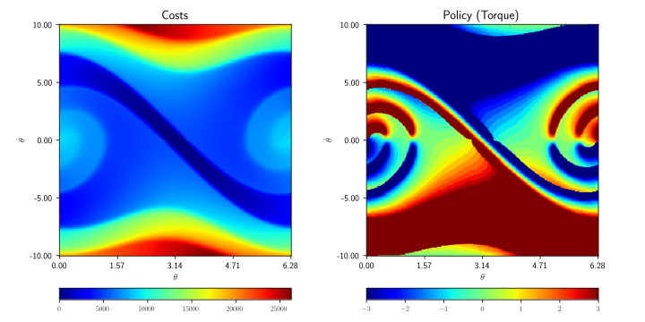

<h1 align="center">madupite</h1>

<div align="center">
<i>a High-Performance Distributed Solver for Large-Scale Markov Decision Processes</i>
<br>

</div>

``madupite`` is a high-performance C++ library with a Python interface designed for solving large-scale **Markov Decision Processes (MDPs)** using **Distributed Inexact Policy Iteration (iPI)**. Leveraging distributed sparse linear solvers from [PETSc](https://petsc.org/), ``madupite`` efficiently handles the computational complexity associated with large-scale MDPs.

## Key Features
- **Scalable MDP Solver**: Efficiently solve MDPs with large state and action spaces using distributed computation.
- **Python and C++ APIs**: Access the power of ``madupite`` through both Python and C++, depending on your performance needs.
- **Distributed Computing**: Integrates with PETSc and MPI for distributed computing on multi-core and cluster environments.

## Installation
After cloning the repository, you can install the package using the following commands. 

```bash
    conda env create -f environment.yml
    conda activate madupiteenv
    pip install .
```

After installation, run `python examples/install/main.py` or `mpirun -n <number of ranks> python examples/install/main.py` to check if the installation was successful.

We recommend using the provided conda environment. If you prefer to rely on your own environment, make sure to install the required dependencies listed in `environment.yml`. We refer to the documentation for more information on the installation process.


## Examples

Solve any stochastic optimal control problem formulated as a Markov Decision Process (MDP) using `madupite`! For example, the fastest way out of a maze or the optimal control input to balance an inverted pendulum:

<div style="display: flex; justify-content: space-between; align-items: stretch;">
  
  
  <br/>
</div>


Examples on how to use `madupite` can be found in the documentation ([tutorial](https://madupite.github.io/tutorial.html) and [examples](https://madupite.github.io/examples.html)) as well as in the `examples` directory. 

In short: The transition probabilities and stage costs can either be loaded from files or generated using functions in the code (or a combination of both): 
* See `examples/tutorial/ex1.py` for an example on how to generate the required data using function in the code.
* See `examples/tutorial/ex2.py` for an example on how to load the required data from files as well as `examples/tutorial/ex2_data_generation.py` to see how the required files can be generated from NumPy or SciPy arrays. 

The [tutorial](https://madupite.github.io/tutorial.html) also provides more detail on the data layout and how to preallocate sparse matrices for improved performance.


## Contributing
Contributions to madupite are welcome! Whether it's reporting bugs, suggesting features, or submitting pull requests, we appreciate your input.

## License
``madupite`` is distributed under the MIT License. See the `LICENSE` file for more information.

## Acknowledgements
`madupite` was developed at the [Automatic Control Laboratory](https://control.ethz.ch/) at [ETH Zurich](https://ethz.ch/en). This work was supported by the European Research Council under the Horizon 2020 Advanced under Grant 787845 (OCAL) and by the SNSF through NCCR Automation (Grant Number 180545). 

If you use `madupite` in your research, please cite it.
