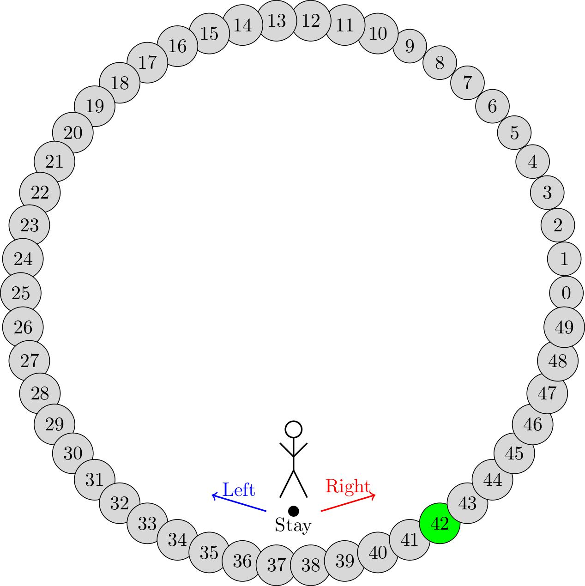

Examples
=============

Here you can find some examples on how to use ``madupite`` to create and solve MDPs arising from different scenarios. But first, a small recap on MDPs.

MDPs are a very useful tool to describe stochastic dynamical systems. In mathematical terms, an MDP is a 5-elements tuple :math:`(\mathcal{S}, \mathcal{A}, P, g, \gamma)`, where: 

* :math:`\mathcal{S} = \{0, 1, \dots, n-1\}` is the set of states,
* :math:`\mathcal{A} = \{0, 1, \dots, m-1\}` is the set of actions,
* :math:`P : \mathcal{S} \times \mathcal{A} \times \mathcal{S} \to [0, 1]` is the transition probability function, where :math:`P(s, a, s') = \text{Pr}(s_{t+1} = s' | s_t = s, a_t = a)` and :math:`\sum_{s' \in \mathcal{S}} P(s, a, s') = 1` for all :math:`s \in \mathcal{S}` and :math:`a \in \mathcal{A}`,
* :math:`g : \mathcal{S} \times \mathcal{A} \to \mathbb{R}` is the stage cost function (or reward in an alternative but equivalent formulation),
* :math:`\gamma \in (0, 1)` is the discount factor.

Given an MDP, ``madupite`` will compute which actions should be played on the system such that the cumulative discounted cost (reward) over the infinite-horizon is minimized (maximized). You can find more details on the mathematical formulation of the problem setting in [Gargiani2024].

Toy-Example
------------

We start with a simple example. 
Let's consider an agent that lives on a periodic 1-dimensional line of length 50. At each time-step, the agent has to decide whether moving to the left, to the right or staying in its place. The goal is to reach state 42 with the minimal number of steps. This problem can be mathematically formulated as an MDP with :math:`\mathcal{S} = \left\{0, \,1,\,\dots,\,49 \right\}` and :math:`\mathcal{A} = \left\{0,\,1,\,2\right\}`, where 0 corresponds to the action *stay*, 1 to the action *move-left* and 2 to the action *move-right*. By moving to the right from state :math:`s` the agent will lend to state :math:`(s+1) \,\text{mod}\, 50` and by moving to the left it will move to state :math:`(s-1) \,\text{mod}\, 50`. Transitions are deterministic in this case and a probability of 1 is associated to the triplet :math:`(s,a,s')` only when :math:`s` is the transitioning state associated to the pair :math:`(s,a)`. Finally, the agent will get a reward of 1 if it reaches state 42, while a reward of 0 is associated to all other state-action pairs.
Imagine also the scenario where our agent is moving on ice. When it tries to move to the left (or right), there is a 10% chance that it falls and ends up staying in its place instead of moving in state :math:`(s-1)\,\text{mod}\,50` (or :math:`(s-1)\,\text{mod}\,50`). The slippery iced floor also introduces a 10% chance that when it plays action 0 it slips to the left or right state. 
Now we turn this into code and use ``madupite`` to model and solve the MDP associated to the described system.

We start by defining the transition probability function for both the deterministic and the stochastic scenario, and the reward function:

.. code-block:: python

    def P_deterministic(state, action):
        if action == 0: # stay
            return [1], [state]
        if action == 1: # left
            return [1], [(state - 1) % 50]
        if action == 2: # right
            return [1], [(state + 1) % 50]

    def P_stochastic(state, action):
        if action == 0: # stay
            return [0.1, 0.8, 0.1], [(state - 1) % 50, state, (state + 1) % 50]
        if action == 1: # left
            return [0.1, 0.9], [state, (state - 1) % 50]
        if action == 2: # right
            return [0.1, 0.9], [state, (state + 1) % 50]
    
    def r(state, action):
        return 1 if state == 42 else 0

Let's start by considering the deterministic scenario: it is full summer and the agent is moving on very dry ground. 
Within the ``main`` function, we first create the ``madupite``-objects for the transition probability tensor and reward matrix with the functions ``createTransitionProbabilityTensor`` and ``createStageCostMatrix``, respectively. Then we generate an instance of the ``madupite`` MDP-class, customize it for this setting, solve it and save the obtained policy and statistics into `policy_deterministic.out` and `stats_deterministic.json` files.

.. code-block:: python
    
    import madupite as md

    def main():

        prealloc = md.MatrixPreallocation()
        prealloc.d_nz = 1
        prealloc.o_nz = 1    

        num_states = 50
        num_actions = 3

        P_mat_deterministic = md.createTransitionProbabilityTensor(
            numStates=num_states,
            numActions=num_actions,
            func=P_deterministic,
            preallocation=prealloc
        )

        r_mat = md.createStageCostMatrix(
            numStates=num_states,
            numActions=num_actions,
            func=r
        )

        mdp = md.MDP()
        mdp.setTransitionProbabilityTensor(P_mat_deterministic)
        mdp.setStageCostMatrix(r_mat)

        mdp.setOption("-mode", "MAXREWARD")
        mdp.setOption("-discount_factor", "0.9")

        mdp.setOption("-file_policy", "policy_deterministic.out")
        mdp.setOption("-file_stats", "stats_deterministic.json")

        mdp.solve()

In case we want to run benchmarks with a different discount factor, inner solver, transition probability tensor, stage cost etc...there is no need to create another MDP-instance, but we can simply re-use the previous one. We now consider the agent moving on ice and, because of the stochasticity, we also increase the discount factor to obtain a more robust policy. For that we add the following code to our ``main`` function. In particular, we have to update the transition probability tensor in our MDP instance ``mdp``, and also the option ``-discount_factor``. Notice that we have to update also the preallocation parameters ``d_nz`` and ``o_nz`` since this time 3 states are reachable from any state. Finally, we save the obtained policy and the statistics in the ``policy_stochastic.out`` and ``stats_stochastic.json`` files.

.. code-block:: python

        prealloc.d_nz = 3
        prealloc.o_nz = 3

        P_mat_stochastic = md.createTransitionProbabilityTensor(
            numStates=num_states,
            numActions=num_actions,
            func=P_stochastic,
            preallocation=prealloc
        )

        mdp.setTransitionProbabilityTensor(P_mat_deterministic)

        mdp.setOption("-file_policy", "policy_stochastic.out")
        mdp.setOption("-file_stats", "statistics_stochastic.json")

        mdp.solve()

To try the example yourself, see ``examples/tutorial/ex1.py``. Run it using ``python ex1.py`` or in parallel using ``mpirun -n <number_of_ranks> python ex1.py`` where ``<number_of_ranks>`` is the number of processes.

In ``examples/tutorial/ex2_data_generation.py`` you can see how to generate the data for this example from a NumPy or SciPy array and save it in ``.bin`` files. In ``examples/tutorial/ex2.py`` you can see how to load the data from the ``.bin`` files and solve the MDP.

Inverted Pendulum
-----------------

``madupite`` can also be used to create and solve MDPs from offline simulation data. In this example for instace we consider offline data collected by simulating an inverted pendulum, whose dynamic is described by the following equation:

.. math::
   :nowrap:

   \begin{eqnarray}
      \ddot{\theta}  + \frac{g}{\ell}\sin(\theta)  & = \frac{F}{m \ell^2}\,, 
   \end{eqnarray}

where :math:`m` and :math:`\ell` are the pendulum mass and length, respectively; :math:`g` is the gravitational acceleration; :math:`\theta` is the angular position of the pendulum, and :math:`F` the torque that we apply on it.
The dynamic is continuous in time and space, therefore we must first discretize it in order to be able to simulate it. In particular, we select 0.01 as time-step and we discretize the space in the ranges :math:`[-10;\,10]` and :math:`[0;\, 2 \pi]` for the angular acceleration and position, respectively, and :math:`[-3;\, 3]` for the action. The finer the discretization grid that we use and the more accurate will be the resulting approximate model, but it will also result into a bigger computational and memory load. ``madupite`` allows one to deploy a finer discretization by distributing the memory and computation across nodes of a computing cluster. 
For the simulation of the pendulum we used different discretization granularities and we collected the data into `.bin` files which you can download here :download:`data.zip (8.4 MB) <data.zip>`.
The goal is to find the values of torque that minimize at each time-step the following stage-cost:

.. math::
   :nowrap:

   \begin{eqnarray}
      g(\theta,\,\dot{\theta},\, F) = (\theta - \pi)^2 + \dot{\theta}^2 + 2 F^2\,. 
   \end{eqnarray}

To fit into the problem setting, we also add a discount factor of 0.999, which approximates well-enough the undiscounted setting. In the following code snippet, we use ``madupite`` to build and solve the MDP associated to the simulation data that we collected from the inverted pendulum when different discretization granularities are used. The optimal policy, cost and statistics are saved into files.

.. code-block:: python

    import madupite as md
    import numpy as np

    def main():

        mdp = md.MDP()

        # the first element in the tuple is the number of states, the second element is the number of actions
        dims_ = [(121, 5), (441, 9), (1681, 11), (10201, 11), (22801, 9)]

        for dim in dims_:

            # Load data from .bin files
            g = md.Matrix.fromFile(
                filename = "data/pend_g_{}_{}.bin".format(dim[0], dim[1]),
                category=md.MatrixCategory.Cost,
                type=md.MatrixType.Dense
            )
            P = md.Matrix.fromFile(
                filename = "data/pend_P_{}_{}.bin".format(dim[0], dim[1]),
                category=md.MatrixCategory.Dynamics,
                type=md.MatrixType.Sparse
            )

            mdp.setStageCostMatrix(g)
            mdp.setTransitionProbabilityTensor(P)

            #mandatory options to select
            mdp.setOption("-mode", "MINCOST")
            mdp.setOption("-discount_factor", "0.999")

            #saving policy, cost and stats into files
            mdp.setOption("-file_policy", "policy_{}_{}.out".format(dim[0], dim[1]))
            mdp.setOption("-file_cost", "cost_{}_{}.out".format(dim[0], dim[1]))
            mdp.setOption("-file_stats", "stats_{}_{}.json".format(dim[0], dim[1]))

            mdp.solve()

    if __name__ == "__main__":
        main()

In this video there is a nice graphic visualization of the results returned by ``madupite`` for different values of the discretization step.

.. video:: _static/pendulum.mp4
    :height: 500
    :width: 900
    :autoplay:
    :loop:
    :poster: _static/pendulum.png

Further examples
----------------

Note that defining data from a function or loading from a file can be combined. See for example the maze example in the ``examples`` folder, where the transition probabilities encode a deterministic movement in a 2D grid world and the maze logic is entirely defined in the cost function which is instead loaded from a `.bin` file that is generated in a separate script. This can also apply to situations where, *e.g.*, the dynamics are generated from experimental data that are collected offline, while the stage-cost is defined by the user, or viceversa.
More examples on the deployment of ``madupite``, such as optimal control of a double integrator, an LQR controller and the derivation of optimal health policies for the infectious disease model, are also provided in the ``examples`` folder.

.. rubric:: References

.. [Gargiani2024] Gargiani, M.; Sieber. R.; Balta, E.; Liao-McPherson, D.; Lygeros, J. *Inexact Policy Iteration Methods for Large-Scale Markov Decision Processes*. `<https://arxiv.org/abs/2404.06136>`_.
