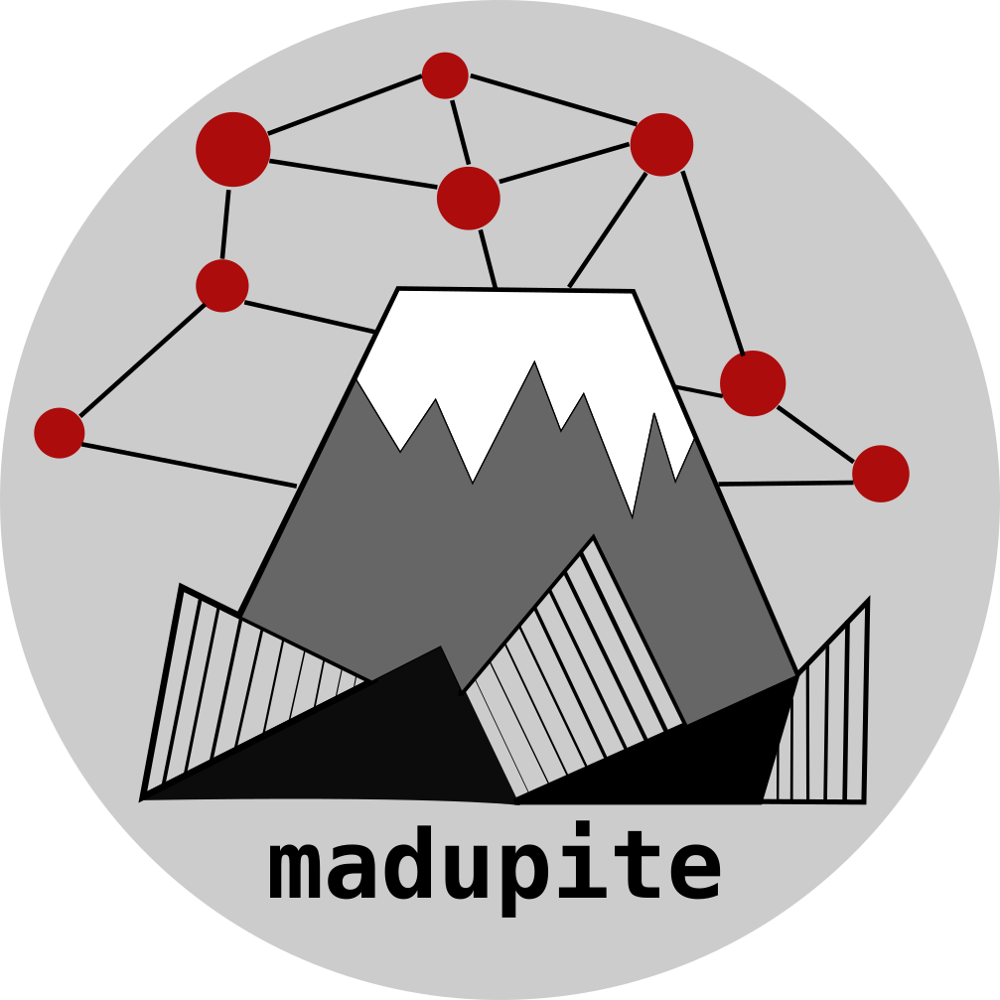

Welcome to madupite's documentation!
======================================
``madupite`` is a Python package for solving large-scale **Ma**\ rkov decision processes (MDP) using **d**\ istrib\ **u**\ ted inexact **p**\ olicy **ite**\ ration `(iPI) <https://arxiv.org/pdf/2211.04299>`_. The library is written in C++ and uses distributed sparse linear solvers from `PETSc <https://petsc.org/>`_.
And, in case you did not know, madupite is also the name of a volcanic rock! 

.. toctree::
   :maxdepth: 2

   Installation <install>
   Tutorials <tutorial>
   Examples <examples>
   Options <options>
   API Reference <apiref>

Index
==================

* :ref:`genindex`

.. :doc:`Examples<examples>`
